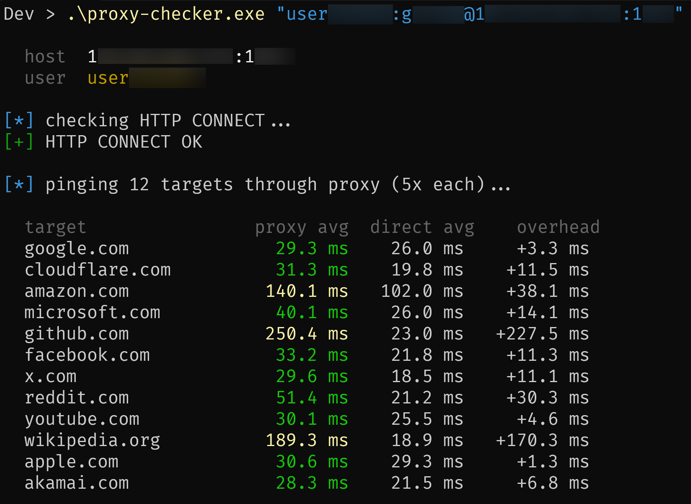
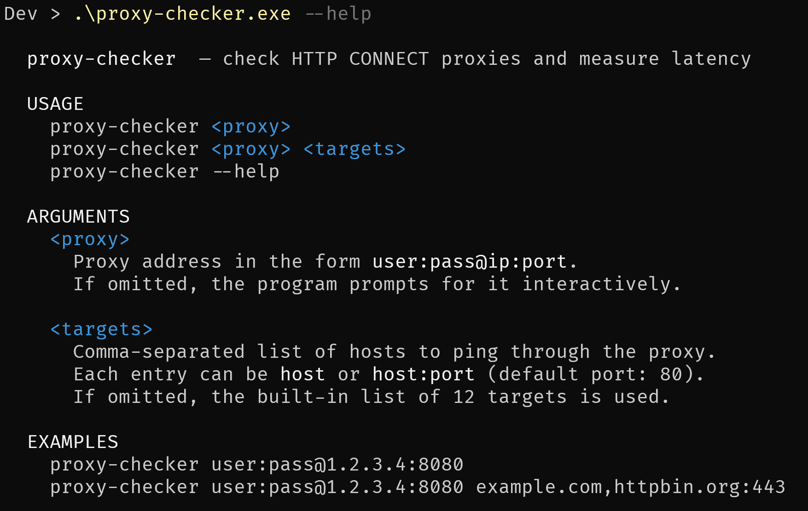

# proxy-checker

[](https://github.com/horhulenko/proxy-checker/actions/workflows/build.yml)
[](https://github.com/horhulenko/proxy-checker/releases/latest)
[](LICENSE)

Checks whether an HTTP CONNECT proxy works and measures its latency against a set of targets, comparing it to a direct connection.



---

## Features

- Verifies HTTP CONNECT tunnel with basic auth
- Pings multiple targets through the proxy and directly, showing overhead per target
- Custom target list via CLI argument
- Color-coded latency output
- Single static binary — no runtime dependencies

---

## Installation

### Download a pre-built binary

Grab the latest release from the [Releases](https://github.com/horhulenko/proxy-checker/releases/latest) page:

| Platform         | File                |
| ---------------- | ------------------- |
| Linux (x86_64)   | `proxy-checker`     |
| Windows (x86_64) | `proxy-checker.exe` |

On Linux, mark it executable after downloading:

```sh
chmod +x proxy-checker
```

### Build from source

Requires [Rust](https://rustup.rs).

```sh
git clone https://github.com/horhulenko/proxy-checker.git
cd proxy-checker
cargo build --release
# binary at: target/release/proxy-checker(.exe)
```

---

## Usage

```
proxy-checker <proxy>
proxy-checker <proxy> <targets>
proxy-checker --help
```

**Arguments**

| Argument    | Description                                                                                        |
| ----------- | -------------------------------------------------------------------------------------------------- |
| `<proxy>`   | Proxy in the form `user:pass@ip:port`. Prompted interactively if omitted.                          |
| `<targets>` | Comma-separated hostnames or `host:port` pairs to ping. Defaults to a built-in list of 12 targets. |

**Examples**

```sh
# basic check
proxy-checker user:pass@1.2.3.4:8080

# custom targets
proxy-checker user:pass@1.2.3.4:8080 example.com,github.com,cloudflare.com:443

# interactive prompt
proxy-checker
```

**Help page**



---

## Output

After a successful HTTP CONNECT check, the tool pings each target and prints a table:

```
  target                proxy avg   direct avg    overhead
  google.com             42.3 ms      11.2 ms    +31.1 ms
  github.com             45.1 ms      13.0 ms    +32.1 ms
  ...
```

Latency is color-coded: green ≤ 100 ms, yellow ≤ 300 ms, red > 300 ms.
